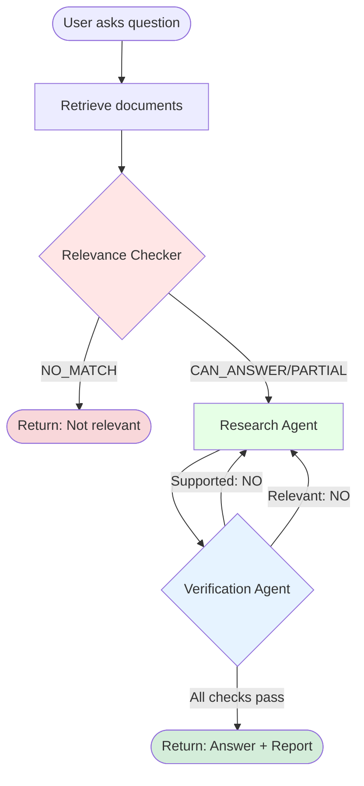

# DocChat Technical Documentation

## 📘 Complete Guide for Developers and Interns

This document provides an in-depth explanation of every component, algorithm, and design decision in the DocChat multi-agent RAG system. By the end of this guide, you'll understand exactly how the system works, from document upload to final answer delivery.

---

## Table of Contents

1. [System Overview](#1-system-overview)
2. [Environment Configuration](#2-environment-configuration)
3. [Document Processing Pipeline](#3-document-processing-pipeline)
4. [Chunking Strategy](#4-chunking-strategy)
5. [Hybrid Retrieval System](#5-hybrid-retrieval-system)
6. [Multi-Agent Architecture](#6-multi-agent-architecture)
7. [Workflow Orchestration](#7-workflow-orchestration)
8. [Code Walkthrough](#8-code-walkthrough)
9. [Performance Optimization](#9-performance-optimization)
10. [Troubleshooting Guide](#10-troubleshooting-guide)

---

## 1. System Overview

### 1.1 What is RAG?

**RAG (Retrieval-Augmented Generation)** is a technique that combines:
- **Retrieval**: Finding relevant information from a knowledge base
- **Generation**: Using an LLM to generate answers based on retrieved information

### 1.2 Why Multi-Agent?

Traditional RAG systems have limitations:
- ❌ Can't filter irrelevant questions
- ❌ No fact-checking of generated answers
- ❌ Can produce hallucinations

**DocChat's Multi-Agent Approach** solves these:
- ✅ **Relevance Checker**: Filters irrelevant questions early
- ✅ **Research Agent**: Generates comprehensive answers
- ✅ **Verification Agent**: Fact-checks answers automatically
- ✅ **Self-Correction Loop**: Refines answers that fail verification

### 1.3 Technology Stack

```
┌─────────────────────────────────────────┐
│  Frontend: Gradio (Web UI)             │
├─────────────────────────────────────────┤
│  Orchestration: LangGraph               │
├─────────────────────────────────────────┤
│  LLM: Azure OpenAI GPT-4                │
├─────────────────────────────────────────┤
│  Vector DB: ChromaDB                    │
├─────────────────────────────────────────┤
│  Embeddings: all-MiniLM-L6-v2 (ONNX)   │
├─────────────────────────────────────────┤
│  Framework: LangChain                   │
└─────────────────────────────────────────┘
```

---

## 2. Environment Configuration

### 2.1 How Configuration Works

DocChat uses **environment variables** for configuration through three layers:

#### Layer 1: `.env` File (Root Directory)

```env
# Your Azure OpenAI credentials
AZURE_OPENAI_API_KEY=your_key_here
AZURE_OPENAI_ENDPOINT=https://your-resource.openai.azure.com/
AZURE_OPENAI_API_VERSION=2024-12-01-preview
AZURE_OPENAI_DEPLOYMENT_NAME=gpt-4
AZURE_OPENAI_MODEL_NAME=gpt-4
```

#### Layer 2: `settings.py` (Configuration Management)

```python
# docchat/config/settings.py
from pydantic_settings import BaseSettings

class Settings(BaseSettings):
    # These are automatically loaded from .env file
    AZURE_OPENAI_API_KEY: str = ""
    AZURE_OPENAI_ENDPOINT: str = ""
    # ... other settings
    
    class Config:
        env_file = ".env"  # 👈 This tells pydantic to load from .env
        env_file_encoding = "utf-8"

# Create singleton instance
settings = Settings()
```

**How it works:**
1. `BaseSettings` from `pydantic_settings` automatically reads `.env`
2. Environment variables are validated and typed
3. Defaults are provided for optional settings
4. Single `settings` instance is shared across the app

#### Layer 3: Agent Usage

```python
# docchat/agents/research_agent.py
from docchat.config.settings import settings  # Import settings

class ResearchAgent:
    def __init__(self):
        self.client = AzureOpenAI(
            api_key=settings.AZURE_OPENAI_API_KEY,      # ✅ Loaded from .env
            api_version=settings.AZURE_OPENAI_API_VERSION,
            azure_endpoint=settings.AZURE_OPENAI_ENDPOINT,
        )
```

### 2.2 Configuration Flow Diagram

```
.env file
   │
   │ (read by pydantic_settings)
   ▼
settings.py (Settings class)
   │
   │ (imported by)
   ▼
┌────────────────────────────────────┐
│  research_agent.py                 │
│  verification_agent.py             │
│  relevance_checker.py              │
│  (All agents use settings)         │
└────────────────────────────────────┘
```

### 2.3 Why This Approach?

✅ **Security**: API keys never hardcoded in source code
✅ **Flexibility**: Easy to change configuration without code changes
✅ **Type Safety**: Pydantic validates all settings
✅ **DRY Principle**: Single source of truth for configuration

---

## 3. Document Processing Pipeline

### 3.1 Overview

The Document Processor (`file_handler.py`) converts raw files into structured chunks that can be searched and retrieved.

### 3.2 Processing Flow

```
User uploads files
        │
        ▼
┌───────────────────────┐
│ 1. VALIDATION         │
│ • Check file sizes    │
│ • Verify file types   │
└──────────┬────────────┘
           │
           ▼
┌───────────────────────┐
│ 2. CACHE CHECK        │
│ • Generate SHA-256    │
│ • Check if cached     │
└──────────┬────────────┘
           │
           ├─── Cache Hit ────► Load from cache
           │
           └─── Cache Miss
                   │
                   ▼
           ┌───────────────────────┐
           │ 3. TEXT EXTRACTION    │
           │ • PDF: pypdf          │
           │ • DOCX: python-docx   │
           │ • TXT/MD: plain read  │
           └──────────┬────────────┘
                      │
                      ▼
           ┌───────────────────────┐
           │ 4. CHUNKING           │
           │ • RecursiveCharacter  │
           │ • 1000 chars chunks   │
           │ • 200 chars overlap   │
           └──────────┬────────────┘
                      │
                      ▼
           ┌───────────────────────┐
           │ 5. CACHING            │
           │ • Save to disk        │
           │ • 7 day expiration    │
           └──────────┬────────────┘
                      │
                      ▼
           ┌───────────────────────┐
           │ 6. DEDUPLICATION      │
           │ • Content-based hash  │
           │ • Remove duplicates   │
           └──────────┬────────────┘
                      │
                      ▼
              Return chunks
```

### 3.3 Code Walkthrough: Document Processor

#### 3.3.1 Validation

```python
def validate_files(self, files: List) -> None:
    """
    Validates that uploaded files don't exceed size limits.
    
    Why? Prevents memory issues and ensures reasonable processing times.
    """
    total_size = 0
    for f in files:
        fpath = f if isinstance(f, str) else f.name
        total_size += os.path.getsize(fpath)
    
    # MAX_TOTAL_SIZE = 200 MB (defined in constants.py)
    if total_size > constants.MAX_TOTAL_SIZE:
        raise ValueError(f"Total size exceeds limit")
```

**Key Points:**
- Checks total size, not individual file sizes
- Prevents out-of-memory errors
- Configurable via `constants.py`

#### 3.3.2 Caching System

```python
def process(self, files: List) -> List[Document]:
    """
    Main processing method with intelligent caching.
    
    Caching Strategy:
    1. Generate SHA-256 hash of file content
    2. Check if cached version exists and is valid (< 7 days old)
    3. If yes, load from cache (fast)
    4. If no, process file and save to cache
    """
    all_chunks = []
    seen_hashes = set()
    
    for file in files:
        # Generate hash of file content
        with open(fpath, "rb") as f:
            file_hash = self._generate_hash(f.read())
        
        cache_path = self.cache_dir / f"{file_hash}.pkl"
        
        if self._is_cache_valid(cache_path):
            # ✅ Cache HIT - Fast path
            logger.info(f"Loading from cache: {fpath}")
            chunks = self._load_from_cache(cache_path)
        else:
            # ❌ Cache MISS - Process file
            logger.info(f"Processing and caching: {fpath}")
            chunks = self._process_file(fpath)
            self._save_to_cache(chunks, cache_path)
```

**Why SHA-256?**
- Content-based hashing: same content = same hash
- If you upload the same file twice, it's recognized instantly
- Cryptographically secure (virtually no collisions)

**Cache Validation:**
```python
def _is_cache_valid(self, cache_path: Path) -> bool:
    """
    Checks if cache is still valid.
    
    Cache expires after CACHE_EXPIRE_DAYS (default: 7 days)
    """
    if not cache_path.exists():
        return False
    
    cache_age = datetime.now() - datetime.fromtimestamp(
        cache_path.stat().st_mtime
    )
    return cache_age < timedelta(days=settings.CACHE_EXPIRE_DAYS)
```

#### 3.3.3 Text Extraction

**PDF Extraction:**
```python
def _read_pdf(self, filepath: str) -> str:
    """
    Extracts text from PDF using pypdf.
    
    Process:
    1. Opens PDF with PdfReader
    2. Iterates through all pages
    3. Extracts text from each page
    4. Joins pages with double newlines
    """
    from pypdf import PdfReader
    
    reader = PdfReader(filepath)
    pages = []
    
    for page in reader.pages:
        page_text = page.extract_text()
        if page_text:  # Skip empty pages
            pages.append(page_text)
    
    return "\n\n".join(pages)
```

**DOCX Extraction:**
```python
def _read_docx(self, filepath: str) -> str:
    """
    Extracts text from DOCX using python-docx.
    
    Process:
    1. Opens DOCX with Document
    2. Iterates through all paragraphs
    3. Extracts text from each paragraph
    4. Joins paragraphs with double newlines
    """
    from docx import Document as DocxDocument
    
    doc = DocxDocument(filepath)
    return "\n\n".join(
        para.text for para in doc.paragraphs if para.text.strip()
    )
```

**TXT/MD Extraction:**
```python
# Simple text files - just read directly
with open(filepath, "r", encoding="utf-8", errors="ignore") as f:
    text = f.read()
```

#### 3.3.4 Deduplication

```python
# Deduplicate chunks across files
for chunk in chunks:
    # Generate hash of chunk content
    chunk_hash = self._generate_hash(chunk.page_content.encode())
    
    if chunk_hash not in seen_hashes:
        all_chunks.append(chunk)      # ✅ New chunk
        seen_hashes.add(chunk_hash)
    # else: ❌ Duplicate - skip it
```

**Why Deduplication?**
- Users might upload overlapping documents
- Prevents redundant information in retrieval
- Saves memory and improves performance

---

## 4. Chunking Strategy

### 4.1 What is Chunking?

**Chunking** is the process of splitting long documents into smaller, manageable pieces.

**Why chunk?**
- LLMs have token limits (can't process entire books)
- Smaller chunks = more precise retrieval
- Enables semantic search at paragraph level

### 4.2 Recursive Character Text Splitter

DocChat uses **RecursiveCharacterTextSplitter** from LangChain:

```python
self.splitter = RecursiveCharacterTextSplitter(
    chunk_size=1000,        # Target size of each chunk
    chunk_overlap=200,       # Overlap between chunks
    separators=["\n\n", "\n", ". ", " ", ""],  # Split priority
)
```

### 4.3 How It Works

#### Example Document:
```
Introduction to AI

Artificial Intelligence is the simulation of human intelligence. 
It involves machine learning and deep learning.

Machine Learning

Machine learning is a subset of AI. It uses algorithms to learn 
from data without explicit programming.

Deep Learning

Deep learning uses neural networks with multiple layers...
```

#### Chunking Process:

**Step 1: Try splitting by `\n\n` (double newline)**
```
Chunk 1: "Introduction to AI\n\nArtificial Intelligence is..."
Chunk 2: "Machine Learning\n\nMachine learning is a subset..."
Chunk 3: "Deep Learning\n\nDeep learning uses neural networks..."
```

**Step 2: If chunks still too large, try `\n` (single newline)**

**Step 3: If still too large, try `. ` (sentence boundary)**

**Step 4: If still too large, try ` ` (word boundary)**

**Step 5: Last resort - split by character**

### 4.4 Chunk Overlap

```
Chunk 1: [==========|==]
                    ▲
                    └─ 200 char overlap
Chunk 2:         [==|==========|==]
                                ▲
                                └─ 200 char overlap
Chunk 3:                     [==|==========]
```

**Why Overlap?**
- ✅ Preserves context across chunk boundaries
- ✅ Prevents information loss at split points
- ✅ Improves retrieval accuracy

**Example:**
```
Without overlap:
Chunk 1: "...AI is important"
Chunk 2: "because it solves..."  ❌ Lost connection

With overlap:
Chunk 1: "...AI is important because it..."
Chunk 2: "...important because it solves..."  ✅ Context preserved
```

### 4.5 Optimal Chunk Size

**Why 1000 characters?**
- ✅ ~200-250 tokens (depends on tokenizer)
- ✅ Typically 1-3 paragraphs
- ✅ Semantic unit (complete thoughts)
- ✅ Fits well in LLM context window

**Too Small (<500 chars):**
- ❌ Loses context
- ❌ More chunks = slower retrieval
- ❌ Semantic fragmentation

**Too Large (>2000 chars):**
- ❌ Less precise retrieval
- ❌ Diluted relevance scores
- ❌ Wastes context window

---

## 5. Hybrid Retrieval System

### 5.1 What is Hybrid Search?

**Hybrid Search** combines two complementary approaches:

1. **BM25 (Keyword Search)** - Traditional information retrieval
2. **Vector Search (Semantic Search)** - Modern AI-powered search

### 5.2 Why Hybrid?

Neither approach is perfect alone:

#### BM25 Strengths:
- ✅ Exact keyword matching
- ✅ Good for specific terms (product names, codes, dates)
- ✅ Fast and lightweight
- ✅ No training required

#### BM25 Weaknesses:
- ❌ Can't understand synonyms
- ❌ Misses semantic relationships
- ❌ Order-dependent

#### Vector Search Strengths:
- ✅ Understands meaning and context
- ✅ Handles synonyms ("car" ≈ "automobile")
- ✅ Semantic similarity
- ✅ Language-independent

#### Vector Search Weaknesses:
- ❌ Can miss exact keywords
- ❌ Computationally expensive
- ❌ Requires quality embeddings

**Hybrid = Best of Both Worlds! 🎯**

### 5.3 Architecture

```
User Query: "What are the installation steps?"
                    │
                    ▼
        ┌───────────────────────┐
        │  ENSEMBLE RETRIEVER   │
        └─────────┬─────────────┘
                  │
        ┌─────────┴─────────┐
        │                   │
        ▼                   ▼
┌───────────────┐   ┌───────────────┐
│ BM25          │   │ VECTOR        │
│ Retriever     │   │ Retriever     │
│ (40% weight)  │   │ (60% weight)  │
└───────┬───────┘   └───────┬───────┘
        │                   │
        │                   ▼
        │           ┌──────────────┐
        │           │ ChromaDB     │
        │           │ + ONNX       │
        │           │ Embeddings   │
        │           └──────┬───────┘
        │                  │
        └─────────┬────────┘
                  │
                  ▼
          Combined Results
      (scored & ranked)
```

### 5.4 Code Walkthrough: Retriever Builder

#### 5.4.1 Initialization

```python
class RetrieverBuilder:
    def __init__(self):
        """
        Initialize with Chroma's built-in ONNX embeddings.
        
        all-MiniLM-L6-v2:
        - 384 dimensions
        - Fast inference (ONNX optimized)
        - No PyTorch required
        - Good balance of quality and speed
        """
        self.embeddings = ChromaDefaultEmbeddings()
```

#### 5.4.2 Building Hybrid Retriever

```python
def build_hybrid_retriever(self, docs):
    """
    Creates a hybrid retriever combining BM25 and vector search.
    
    Weights: [0.4, 0.6] means:
    - 40% of the score comes from BM25
    - 60% of the score comes from vector similarity
    
    This favors semantic understanding while still respecting
    exact keyword matches.
    """
    # Step 1: Build vector store
    vector_store = self._build_vector_store(docs)
    
    # Step 2: Build BM25 retriever
    bm25 = self._build_bm25(docs)
    
    # Step 3: Combine into ensemble
    hybrid_retriever = EnsembleRetriever(
        retrievers=[
            bm25,
            vector_store.as_retriever(
                search_kwargs={"k": settings.VECTOR_SEARCH_K}  # Top-10
            )
        ],
        weights=[0.4, 0.6],  # BM25: 40%, Vector: 60%
    )
    
    return hybrid_retriever
```

#### 5.4.3 Vector Store (ChromaDB)

```python
def _build_vector_store(self, docs):
    """
    Builds the vector store using ChromaDB.
    
    What happens here:
    1. Each document chunk is embedded (text → 384-dim vector)
    2. Vectors are stored in ChromaDB (in-memory by default)
    3. Creates index for fast similarity search
    """
    return Chroma.from_documents(
        documents=docs,
        embedding=self.embeddings,  # all-MiniLM-L6-v2
    )
```

**How Vector Similarity Works:**

```
User Query: "installation steps"
    │
    ▼
Embedding Function (all-MiniLM-L6-v2)
    │
    ▼
Query Vector: [0.23, -0.45, 0.67, ..., 0.12]  # 384 dimensions
    │
    ▼
Compare with all document vectors using Cosine Similarity
    │
    ▼
Document 1: similarity = 0.92  ✅ High (relevant)
Document 2: similarity = 0.45  ⚠️ Medium
Document 3: similarity = 0.12  ❌ Low (irrelevant)
    │
    ▼
Return top-k most similar documents
```

**Cosine Similarity Formula:**
```
similarity(A, B) = (A · B) / (||A|| × ||B||)

Where:
- A · B = dot product
- ||A|| = magnitude of vector A
- ||B|| = magnitude of vector B
```

Result: Score between -1 and 1 (higher = more similar)

#### 5.4.4 BM25 Retriever

```python
def _build_bm25(self, docs):
    """
    Builds the BM25 retriever for keyword matching.
    
    BM25 (Best Matching 25):
    - Ranks documents based on term frequency
    - Considers document length
    - Applies inverse document frequency (IDF)
    """
    return BM25Retriever.from_documents(docs)
```

**How BM25 Works:**

BM25 score formula:
```
score(D, Q) = Σ IDF(qi) × (f(qi, D) × (k1 + 1)) / (f(qi, D) + k1 × (1 - b + b × |D|/avgdl))

Where:
- D = document
- Q = query
- qi = query term i
- f(qi, D) = frequency of qi in D
- |D| = length of document D
- avgdl = average document length
- k1, b = tuning parameters
```

**Simplified Explanation:**
1. Count how many times query words appear in document
2. Boost rare words (IDF)
3. Penalize very long documents
4. Normalize scores

**Example:**
```
Query: "install python package"
Document: "To install a Python package, use pip install package_name..."

BM25 Scoring:
- "install": appears 2 times, common word → score +1.5
- "python": appears 1 time, medium rarity → score +2.0
- "package": appears 2 times, common → score +1.8
Total BM25 score: 5.3
```

### 5.5 Ensemble Scoring

```python
# Pseudo-code for ensemble scoring
def ensemble_score(doc, query):
    bm25_score = bm25_retriever.score(doc, query)
    vector_score = vector_retriever.score(doc, query)
    
    # Weighted combination
    final_score = (0.4 × bm25_score) + (0.6 × vector_score)
    
    return final_score
```

**Example Scoring:**
```
Document A:
- BM25 score: 8.2
- Vector score: 0.75
- Final: (0.4 × 8.2) + (0.6 × 0.75) = 3.28 + 0.45 = 3.73

Document B:
- BM25 score: 5.1
- Vector score: 0.92
- Final: (0.4 × 5.1) + (0.6 × 0.92) = 2.04 + 0.552 = 2.59

→ Document A ranks higher ✅
```

### 5.6 Why These Weights (40/60)?

- **60% Vector**: Prioritizes semantic understanding
- **40% BM25**: Ensures exact keywords aren't ignored
- Based on empirical studies and common practice
- Configurable via `settings.HYBRID_RETRIEVER_WEIGHTS`

---

## 6. Multi-Agent Architecture

### 6.1 Agent Roles

DocChat uses three specialized agents, each with a specific responsibility:

```
┌─────────────────────────────────────────────────────┐
│ RELEVANCE CHECKER                                   │
│ Role: Gatekeeper                                    │
│ Job: "Is this question answerable from documents?"  │
│ Output: CAN_ANSWER | PARTIAL | NO_MATCH            │
└─────────────────────────────────────────────────────┘
                        │
                        ▼ (if relevant)
┌─────────────────────────────────────────────────────┐
│ RESEARCH AGENT                                      │
│ Role: Researcher                                    │
│ Job: "Generate comprehensive answer from context"   │
│ Output: Draft answer                                │
└─────────────────────────────────────────────────────┘
                        │
                        ▼
┌─────────────────────────────────────────────────────┐
│ VERIFICATION AGENT                                  │
│ Role: Fact-checker                                  │
│ Job: "Is this answer supported by the documents?"   │
│ Output: Verification report                         │
└─────────────────────────────────────────────────────┘
```

### 6.2 Agent 1: Relevance Checker

#### Purpose
Determines if the user's question can be answered from the uploaded documents.

#### Logic Flow

```python
def check(self, question: str, retriever, k: int = 3) -> str:
    """
    Step 1: Retrieve top-k documents (k=3 for quick check)
    Step 2: Combine into context
    Step 3: Ask GPT-4 to classify relevance
    Step 4: Return classification
    """
    # Retrieve documents
    top_docs = retriever.invoke(question)
    if not top_docs:
        return "NO_MATCH"
    
    # Combine top-k documents
    document_content = "\n\n".join(
        doc.page_content for doc in top_docs[:k]
    )
    
    # Build prompt
    prompt = f"""You are an AI relevance checker.
    
Classify how well the document content addresses the question.
Respond with ONLY one of: CAN_ANSWER, PARTIAL, NO_MATCH

**Labels:**
1) "CAN_ANSWER": Passages contain enough information to fully answer
2) "PARTIAL": Passages mention topic but don't provide all details
3) "NO_MATCH": Passages don't discuss the topic at all

**Question:** {question}
**Passages:** {document_content}

Respond ONLY with: CAN_ANSWER, PARTIAL, NO_MATCH"""
    
    # Call GPT-4
    response = self._call_llm(prompt)
    classification = response.choices[0].message.content.strip().upper()
    
    return classification  # "CAN_ANSWER", "PARTIAL", or "NO_MATCH"
```

#### LLM Configuration
```python
def _call_llm(self, prompt: str):
    return self.client.chat.completions.create(
        model=self.deployment,  # gpt-4
        messages=[{"role": "user", "content": prompt}],
        temperature=0,      # ← Deterministic (no creativity needed)
        max_tokens=10,      # ← Very short response expected
    )
```

**Why temperature=0?**
- Classification task requires consistency
- Same question should always give same classification
- No need for creative responses

**Why max_tokens=10?**
- Response is just one word: "CAN_ANSWER", "PARTIAL", or "NO_MATCH"
- Saves costs and latency

#### Example Scenarios

**Scenario 1: CAN_ANSWER**
```
Question: "What is the installation process?"
Documents contain: "Installation Steps: 1. Download, 2. Run setup.exe..."
Classification: CAN_ANSWER ✅
```

**Scenario 2: PARTIAL**
```
Question: "What is the pricing for enterprise plans?"
Documents contain: "We offer enterprise plans..." (but no specific pricing)
Classification: PARTIAL ⚠️
```

**Scenario 3: NO_MATCH**
```
Question: "What is the weather today?"
Documents contain: Technical documentation
Classification: NO_MATCH ❌
```

### 6.3 Agent 2: Research Agent

#### Purpose
Generates comprehensive, factual answers based on retrieved context.

#### Logic Flow

```python
def generate(self, question: str, documents: List[Document]) -> Dict:
    """
    Step 1: Combine all retrieved documents into context
    Step 2: Build structured prompt
    Step 3: Call GPT-4 to generate answer
    Step 4: Sanitize and return
    """
    # Step 1: Combine context
    context = "\n\n".join([doc.page_content for doc in documents])
    
    # Step 2: Generate prompt
    prompt = self.generate_prompt(question, context)
    
    # Step 3: Call LLM
    response = self._call_llm(prompt)
    llm_response = response.choices[0].message.content.strip()
    
    # Step 4: Sanitize
    draft_answer = self.sanitize_response(llm_response) if llm_response else \
        "I cannot answer this question based on the provided documents."
    
    return {
        "draft_answer": draft_answer,
        "context_used": context
    }
```

#### Prompt Engineering

```python
def generate_prompt(self, question: str, context: str) -> str:
    return f"""You are an AI assistant designed to provide precise and factual answers based on the given context.

**Instructions:**
- Answer the following question using only the provided context.
- Be clear, concise, and factual.
- Return as much information as you can get from the context.
- If the context does not contain enough information, say so.

**Question:** {question}

**Context:**
{context}

**Provide your answer below:**"""
```

**Prompt Design Principles:**
1. **Role definition**: "You are an AI assistant..."
2. **Constraints**: "using only the provided context"
3. **Style guide**: "Be clear, concise, and factual"
4. **Fallback instruction**: "If...say so"
5. **Structured format**: Clear sections

#### LLM Configuration
```python
def _call_llm(self, prompt: str):
    return self.client.chat.completions.create(
        model=self.deployment,  # gpt-4
        messages=[{"role": "user", "content": prompt}],
        temperature=0.3,    # ← Slight creativity for natural language
        max_tokens=800,     # ← Comprehensive answers
    )
```

**Why temperature=0.3?**
- Low enough for factual accuracy
- High enough for fluent, natural responses
- Balances faithfulness and readability

**Why max_tokens=800?**
- Allows detailed answers (2-4 paragraphs)
- Prevents excessively long responses
- ~600-800 words typically

### 6.4 Agent 3: Verification Agent

#### Purpose
Fact-checks the generated answer against source documents.

#### Logic Flow

```python
def check(self, answer: str, documents: List[Document]) -> Dict:
    """
    Step 1: Combine documents into source context
    Step 2: Build verification prompt
    Step 3: Call GPT-4 to verify
    Step 4: Parse structured response
    Step 5: Format verification report
    """
    # Step 1: Source context
    context = "\n\n".join([doc.page_content for doc in documents])
    
    # Step 2: Build prompt
    prompt = self.generate_prompt(answer, context)
    
    # Step 3: LLM verification
    response = self._call_llm(prompt)
    llm_response = response.choices[0].message.content.strip()
    
    # Step 4: Parse response
    verification = self.parse_verification_response(llm_response)
    
    # Step 5: Format report
    report = self.format_verification_report(verification)
    
    return {
        "verification_report": report,
        "context_used": context
    }
```

#### Verification Criteria

```python
prompt = f"""You are an AI assistant designed to verify the accuracy and relevance of answers based on provided context.

**Instructions:**
- Verify the following answer against the provided context.
- Check for:
  1. Direct/indirect factual support (YES/NO)
  2. Unsupported claims (list any if present)
  3. Contradictions (list any if present)
  4. Relevance to the question (YES/NO)
- Provide additional details or explanations where relevant.
- Respond in the exact format specified below.

**Format:**
Supported: YES/NO
Unsupported Claims: [item1, item2, ...]
Contradictions: [item1, item2, ...]
Relevant: YES/NO
Additional Details: [Any extra information]

**Answer:** {answer}

**Context:** {context}

**Respond ONLY with the above format.**"""
```

#### Response Parsing

```python
def parse_verification_response(self, response_text: str) -> Dict:
    """
    Parses structured verification response.
    
    Expected format:
        Supported: YES
        Unsupported Claims: [claim1, claim2]
        Contradictions: []
        Relevant: YES
        Additional Details: The answer is accurate.
    """
    verification = {}
    lines = response_text.split("\n")
    
    for line in lines:
        if ":" in line:
            key, value = line.split(":", 1)
            key = key.strip().capitalize()
            value = value.strip()
            
            # Parse lists
            if key in {"Unsupported claims", "Contradictions"}:
                if value.startswith("[") and value.endswith("]"):
                    items = value[1:-1].split(",")
                    items = [item.strip().strip('"').strip("'") 
                            for item in items if item.strip()]
                    verification[key] = items
            else:
                verification[key] = value.upper() if key in {"Supported", "Relevant"} else value
    
    return verification
```

#### LLM Configuration
```python
def _call_llm(self, prompt: str):
    return self.client.chat.completions.create(
        model=self.deployment,  # gpt-4
        messages=[{"role": "user", "content": prompt}],
        temperature=0.0,    # ← Maximum consistency
        max_tokens=500,     # ← Detailed verification report
    )
```

**Why temperature=0.0?**
- Verification requires maximum determinism
- No creativity needed for fact-checking
- Consistent results across runs

### 6.5 Agent Comparison

| Agent | Role | Temperature | Max Tokens | Output |
|-------|------|-------------|------------|--------|
| Relevance Checker | Filter | 0.0 | 10 | Classification |
| Research Agent | Generator | 0.3 | 800 | Answer |
| Verification Agent | Validator | 0.0 | 500 | Report |

---

## 7. Workflow Orchestration

### 7.1 LangGraph Overview

**LangGraph** is a library for building stateful, multi-agent workflows as directed graphs.

**Key Concepts:**
- **Nodes**: Individual steps (agent calls, processing)
- **Edges**: Transitions between nodes
- **State**: Shared data structure passed between nodes
- **Conditional Edges**: Dynamic routing based on state

### 7.2 Workflow State

```python
class AgentState(TypedDict):
    """
    Shared state passed through the workflow.
    Each node can read and modify this state.
    """
    question: str                    # User's question
    documents: List[Document]        # Retrieved documents
    draft_answer: str                # Generated answer
    verification_report: str         # Verification results
    is_relevant: bool                # Relevance check result
    retriever: EnsembleRetriever     # Retriever instance
```

### 7.3 Workflow Graph

```python
def build_workflow(self):
    """
    Builds the multi-agent workflow graph using LangGraph.
    
    Graph structure:
    
    START
      │
      ▼
    check_relevance
      │
      ├──► (irrelevant) ──► END
      │
      ▼ (relevant)
    research
      │
      ▼
    verify
      │
      ├──► (failed) ──► research (self-correction loop)
      │
      ▼ (passed)
    END
    """
    workflow = StateGraph(AgentState)
    
    # Add nodes
    workflow.add_node("check_relevance", self._check_relevance_step)
    workflow.add_node("research", self._research_step)
    workflow.add_node("verify", self._verification_step)
    
    # Set entry point
    workflow.set_entry_point("check_relevance")
    
    # Add conditional edge after relevance check
    workflow.add_conditional_edges(
        "check_relevance",
        self._decide_after_relevance_check,
        {"relevant": "research", "irrelevant": END},
    )
    
    # Add edge from research to verify
    workflow.add_edge("research", "verify")
    
    # Add conditional edge after verification
    workflow.add_conditional_edges(
        "verify",
        self._decide_next_step,
        {"re_research": "research", "end": END},
    )
    
    return workflow.compile()
```

### 7.4 Node Implementations

#### Node 1: Relevance Check

```python
def _check_relevance_step(self, state: AgentState) -> Dict:
    """
    Checks if question is relevant to documents.
    
    Returns:
        Updates to state (is_relevant, draft_answer if irrelevant)
    """
    retriever = state["retriever"]
    classification = self.relevance_checker.check(
        question=state["question"],
        retriever=retriever,
        k=20,  # Check top-20 for better coverage
    )
    
    if classification == "CAN_ANSWER":
        return {"is_relevant": True}
    elif classification == "PARTIAL":
        return {"is_relevant": True}  # Still try to answer
    else:  # NO_MATCH
        return {
            "is_relevant": False,
            "draft_answer": (
                "This question isn't related to your uploaded documents. "
                "Please ask another question relevant to the documents."
            ),
        }
```

#### Node 2: Research

```python
def _research_step(self, state: AgentState) -> Dict:
    """
    Generates answer using research agent.
    
    Returns:
        Updates to state (draft_answer)
    """
    result = self.researcher.generate(
        state["question"],
        state["documents"]
    )
    logger.info("Research agent completed draft answer.")
    return {"draft_answer": result["draft_answer"]}
```

#### Node 3: Verification

```python
def _verification_step(self, state: AgentState) -> Dict:
    """
    Verifies answer using verification agent.
    
    Returns:
        Updates to state (verification_report)
    """
    result = self.verifier.check(
        state["draft_answer"],
        state["documents"]
    )
    logger.info("Verification agent completed report.")
    return {"verification_report": result["verification_report"]}
```

### 7.5 Conditional Routing

#### After Relevance Check

```python
def _decide_after_relevance_check(self, state: AgentState) -> str:
    """
    Routes based on relevance classification.
    
    Returns:
        "relevant" → continue to research
        "irrelevant" → end workflow
    """
    decision = "relevant" if state["is_relevant"] else "irrelevant"
    logger.info(f"Relevance decision: {decision}")
    return decision
```

#### After Verification

```python
def _decide_next_step(self, state: AgentState) -> str:
    """
    Routes based on verification result.
    
    Self-correction logic:
    - If verification fails → re-research
    - If verification passes → end workflow
    
    Returns:
        "re_research" → loop back to research node
        "end" → complete workflow
    """
    verification_report = state["verification_report"]
    
    # Check if answer is unsupported or irrelevant
    if ("Supported: NO" in verification_report or 
        "Relevant: NO" in verification_report):
        logger.info("Verification failed — triggering re-research loop.")
        return "re_research"
    else:
        logger.info("Verification successful — ending workflow.")
        return "end"
```

### 7.6 Self-Correction Loop

The self-correction loop is a key feature:

```
research → verify → (fail) → research → verify → (fail) → research → ...
                      ↑                                      │
                      └──────────────────────────────────────┘
```

**How it helps:**
- First draft might miss key information
- Verification identifies issues
- Research agent gets another chance
- Continues until verification passes

**Why it works:**
- GPT-4 is non-deterministicseed different phrasing each iteration
- Forces agent to reconsider the context
- Usually converges within 1-2 iterations

**Safeguard against infinite loops:**
```python
# In practice, you might add:
max_iterations = 3
if iteration_count > max_iterations:
    return "end"  # Force exit after 3 attempts
```

### 7.7 Full Pipeline Execution

```python
def full_pipeline(self, question: str, retriever: EnsembleRetriever):
    """
    Executes the complete multi-agent pipeline.
    
    Flow:
    1. Retrieve relevant documents
    2. Create initial state
    3. Run the compiled workflow graph
    4. Return final results
    """
    try:
        logger.info(f"Starting pipeline with question='{question}'")
        
        # Step 1: Retrieve documents
        documents = retriever.invoke(question)
        logger.info(f"Retrieved {len(documents)} relevant documents.")
        
        # Step 2: Initialize state
        initial_state = AgentState(
            question=question,
            documents=documents,
            draft_answer="",
            verification_report="",
            is_relevant=False,
            retriever=retriever,
        )
        
        # Step 3: Execute workflow
        final_state = self.compiled_workflow.invoke(initial_state)
        
        # Step 4: Return results
        return {
            "draft_answer": final_state["draft_answer"],
            "verification_report": final_state["verification_report"],
        }
        
    except Exception as e:
        logger.error(f"Workflow execution failed: {e}")
        raise
```

### 7.8 Workflow Visualization



---

## 8. Code Walkthrough

### 8.1 Application Entry Point

**File: `run_docchat.py`**

```python
"""
Application launcher.
Sets up Python path and starts the Gradio UI.
"""
import sys
import os

# Add workspace root to Python path
ROOT = os.path.dirname(os.path.abspath(__file__))
if ROOT not in sys.path:
    sys.path.insert(0, ROOT)

# Import and run main app
from docchat.app import main

if __name__ == "__main__":
    main()
```

### 8.2 Main Application

**File: `docchat/app.py`**

```python
def main():
    """
    Main application function.
    
    Steps:
    1. Initialize all components
    2. Build Gradio UI
    3. Define processing logic
    4. Launch server
    """
    # Step 1: Initialize components
    processor = DocumentProcessor()
    retriever_builder = RetrieverBuilder()
    workflow = AgentWorkflow()
    
    # Step 2: Build Gradio interface
    with gr.Blocks(title="DocChat") as demo:
        # UI components...
        
        # Session state for caching
        session_state = gr.State({
            "file_hashes": frozenset(),
            "retriever": None
        })
        
        # Step 3: Define processing function
        def process_question(question_text, uploaded_files, state):
            # Validate inputs
            if not question_text or not uploaded_files:
                raise ValueError("Question and files required")
            
            # Check if documents changed (cache management)
            current_hashes = _get_file_hashes(uploaded_files)
            
            if state["retriever"] is None or current_hashes != state["file_hashes"]:
                # New/changed documents - reprocess
                chunks = processor.process(uploaded_files)
                retriever = retriever_builder.build_hybrid_retriever(chunks)
                state.update({
                    "file_hashes": current_hashes,
                    "retriever": retriever
                })
            
            # Run full pipeline
            result = workflow.full_pipeline(
                question=question_text,
                retriever=state["retriever"],
            )
            
            return result["draft_answer"], result["verification_report"], state
        
        # Connect button to function
        submit_btn.click(
            fn=process_question,
            inputs=[question, files, session_state],
            outputs=[answer_output, verification_output, session_state],
        )
    
    # Step 4: Launch
    demo.launch(server_name="127.0.0.1", server_port=7860, share=False)
```

### 8.3 Session State Management

```python
def _get_file_hashes(uploaded_files: List) -> frozenset:
    """
    Generate SHA-256 hashes for all uploaded files.
    
    Why frozenset?
    - Immutable (can be compared directly)
    - Order-independent
    - Hashable (can be used as dict key)
    """
    hashes = set()
    for file in uploaded_files:
        fpath = file if isinstance(file, str) else file.name
        with open(fpath, "rb") as f:
            hashes.add(hashlib.sha256(f.read()).hexdigest())
    return frozenset(hashes)
```

**Smart Caching:**
```python
if state["retriever"] is None or current_hashes != state["file_hashes"]:
    # Documents changed - rebuild retriever
    chunks = processor.process(uploaded_files)
    retriever = retriever_builder.build_hybrid_retriever(chunks)
    state.update({"file_hashes": current_hashes, "retriever": retriever})
else:
    # Documents unchanged - use cached retriever ✅
    # This saves significant processing time!
```

---

## 9. Performance Optimization

### 9.1 Caching Strategies

#### Document-Level Caching
- **Location**: `document_cache/`
- **Key**: SHA-256 hash of file content
- **Expiration**: 7 days
- **Benefit**: Avoids re-parsing PDFs/DOCX

#### Session-Level Caching
- **Location**: Gradio state
-  **Key**: File hashes frozenset
- **Expiration**: Session end
- **Benefit**: Avoids rebuilding vector store

### 9.2 Retrieval Optimization

```python
# Top-k limits

# Relevance check: Only need 3 docs for quick validation
relevance_checker.check(question, retriever, k=3)

# Research: Use all retrieved docs (typically 10-20)
researcher.generate(question, documents)

# Verification: Use same docs as research
verifier.check(answer, documents)
```

### 9.3 LLM Token Optimization

| Agent | Avg Input Tokens | Max Output | Total Cost |
|-------|-----------------|------------|------------|
| Relevance | ~500 | 10 | Low |
| Research | ~3000 | 800 | Medium |
| Verification | ~4000 | 500 | Medium |

**Cost Saving Tips:**
1. Use relevance filter to avoid unnecessary research
2. Limit retrieved document count
3. Use appropriate max_tokens per agent
4. Cache retriever to avoid rebuilding

---

## 10. Troubleshooting Guide

### 10.1 Common Issues

#### Issue: "No module named 'docchat'"

**Cause**: Python path not set correctly

**Solution**:
```bash
# Run from project root
cd doc_chat
python run_docchat.py
```

#### Issue: "Azure OpenAI API error"

**Cause**: Invalid credentials or endpoint

**Solution**:
1. Check `.env` file exists
2. Verify `AZURE_OPENAI_API_KEY` is correct
3. Check `AZURE_OPENAI_ENDPOINT` format:
   - ✅ `https://your-resource.openai.azure.com/`
   - ❌ `https://your-resource.openai.azure.com` (missing slash)

#### Issue: "Out of memory"

**Cause**: Too many/large documents

**Solution**:
```python
# Reduce limits in constants.py
MAX_TOTAL_SIZE = 100 * 1024 * 1024  # 100 MB
```

#### Issue: "Answers are not accurate"

**Cause**: Retrieval not finding relevant chunks

**Solutions**:
1. Increase chunk overlap:
   ```python
   chunk_overlap=300  # from 200
   ```
2. Adjust hybrid weights:
   ```python
   HYBRID_RETRIEVER_WEIGHTS = [0.5, 0.5]  # More BM25
   ```
3. Increase top-k:
   ```python
   VECTOR_SEARCH_K = 15  # from 10
   ```

### 10.2 Debugging Tips

#### Enable Debug Logging

```python
# In docchat/config/settings.py
LOG_LEVEL: str = "DEBUG"  # from "INFO"
```

#### Inspect Retrieved Documents

```python
# In workflow.py full_pipeline()
documents = retriever.invoke(question)
print(f"Retrieved {len(documents)} docs:")
for i, doc in enumerate(documents[:3]):
    print(f"\nDoc {i}: {doc.page_content[:200]}...")
```

#### Check Agent Responses

```python
# In research_agent.py generate()
print(f"LLM Response: {llm_response}")
print(f"Final Answer: {draft_answer}")
```

---

## 11. Architecture Diagrams

### 11.1 System Architecture

```
┌────────────────────────────────────────────────────────────┐
│                     USER LAYER                             │
│                   (Gradio Web UI)                          │
└───────────────────────┬────────────────────────────────────┘
                        │ HTTP
                        ▼
┌───────────────────────────────────────────────────────────┐
│               APPLICATION LAYER                           │
│  ┌─────────────────────────────────────────────────────┐  │
│  │  app.py (Main Orchestrator)                         │  │
│  │  - Session management                               │  │
│  │  - Request handling                                 │  │
│  │  - Response formatting                              │  │
│  └──────────────────┬──────────────────────────────────┘  │
│                     │                                     │
│  ┌──────────────────┼──────────────────────────────────┐  │
│  │  Configuration   │  Settings & Constants            │  │
│  └──────────────────┼──────────────────────────────────┘  │
└────────────────────┬─┴──────────────────┬────────────────┘
                     │                    │
        ┌────────────┼────────────────────┼────────────┐
        │            │                    │            │
        ▼            ▼                    ▼            ▼
┌──────────┐  ┌──────────┐        ┌──────────┐  ┌──────────┐
│Document  │  │Retriever │        │ Agent    │  │  Utils   │
│Processor │  │ Builder  │        │ Workflow │  │ Logging  │
└──────────┘  └──────────┘        └────┬─────┘  └──────────┘
     │             │                    │
     │             │        ┌───────────┼───────────┐
     │             │        │           │           │
     │             │        ▼           ▼           ▼
     │             │   ┌─────────┐ ┌─────────┐ ┌─────────┐
     │             │   │Relevance│ │Research │ │  Verify │
     │             │   │ Checker │ │  Agent  │ │  Agent  │
     │             │   └─────────┘ └─────────┘ └─────────┘
     │             │        │           │           │
     ▼             ▼        └───────────┼───────────┘
┌──────────┐  ┌──────────┐             │
│  File    │  │ChromaDB  │             │
│  Cache   │  │Vector DB │             │
└──────────┘  └──────────┘             │
                                       ▼
                              ┌─────────────────┐
                              │ Azure OpenAI    │
                              │ (GPT-4)         │
                              └─────────────────┘
```

### 11.2 Data Flow

```
1. User uploads files
        │
        ▼
2. DocumentProcessor extracts text → chunks
        │
        ▼
3. RetrieverBuilder creates hybrid retriever
    ├─► BM25 index
    └─► Vector embeddings → ChromaDB
        │
        ▼
4. User asks question
        │
        ▼
5. Hybrid retriever fetches relevant chunks
        │
        ▼
6. Relevance Checker validates (GPT-4)
        │
        ▼
7. Research Agent generates answer (GPT-4)
        │
        ▼
8. Verification Agent fact-checks (GPT-4)
        │
        ├─► Fails → Loop back to Research
        │
        └─► Passes → Return to user
```

---

## 12. Conclusion

This technical documentation covered:

✅ **Configuration**: How .env files load into agents
✅ **Document Processing**: Parsing, chunking, caching
✅ **Chunking Strategy**: Recursive splitting with overlap
✅ **Hybrid Retrieval**: BM25 + Vector search ensemble
✅ **Multi-Agent System**: Relevance, Research, Verification
✅ **Workflow Orchestration**: LangGraph state machine
✅ **Self-Correction Loop**: Iterative refinement
✅ **Performance Optimization**: Caching and smart retrieval
✅ **Troubleshooting**: Common issues and solutions

### Key Takeaways

1. **Multi-Agent > Single Agent**: Separation of concernstter quality
2. **Hybrid > Pure Vector**: Combines exact and semantic matching
3. **Verification is Critical**: Catches hallucinations automatically
4. **Caching is Essential**: Dramatically improves user experience
5. **Prompt Engineering Matters**: Structured prompts yield better results

### Next Steps

- Experiment with different chunk sizes
- Adjust hybrid weights for your domain
- Add custom agents for specific tasks
- Implement rate limiting and error handling
- Add support for more file types
- Build custom evaluation metrics

---

**Questions?** Review the code with this document side-by-side. Every design decision has been explained from first principles!

